# FIAP Applying Analytics Arquitecture

## Grupo

* Bernardo Couto
* Raphael Freixo
* Ronaldo Nolasco

## Backlog

Sprint 1:

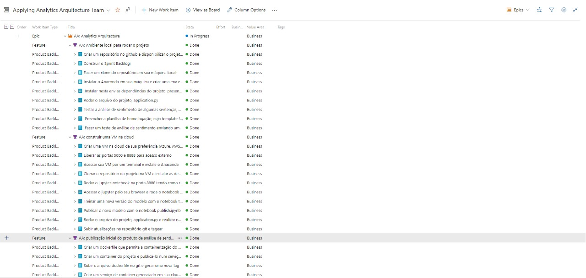

Sprint 2:

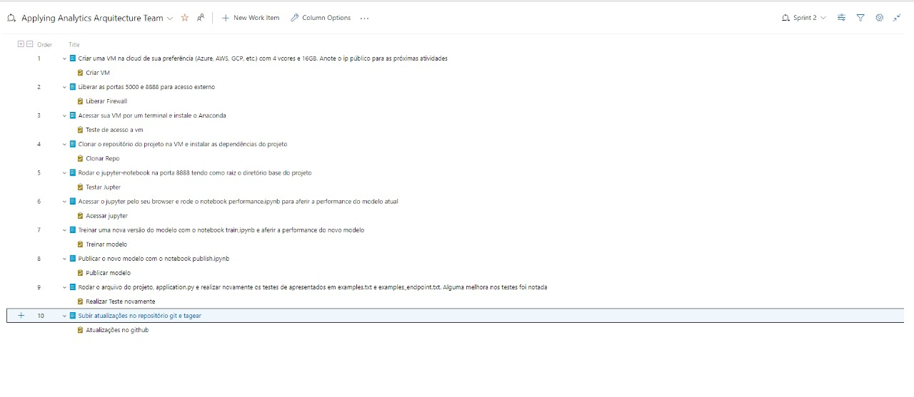

Sprint 3:

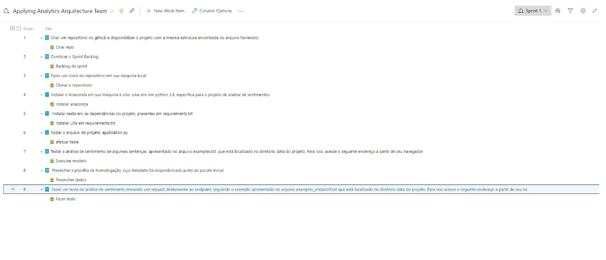

Sprint 4:

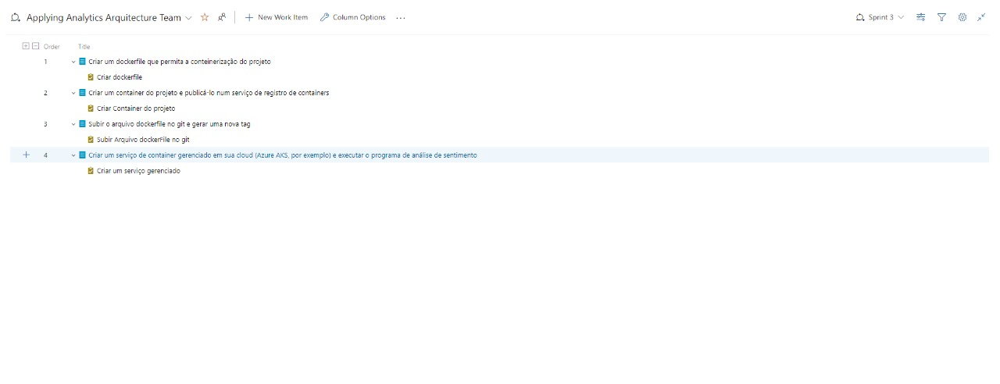

## Anaconda

Iniciando Anaconda:

```shel
$ conda init
```

Listando ambientes virtuais:

```shel
$ conda env list
```

Criando ambiente virtual:

```shel
$ conda env create --name fiap --file requirements.txt
```

Ativando ambiente virtual:

```shel
$ conda activate fiap
```

Ambiente virtual:


Anaconda Jupyter local:

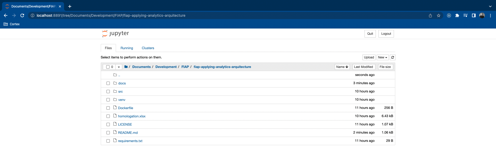

## AWS

### EC2

Instância criada no AWS EC2:

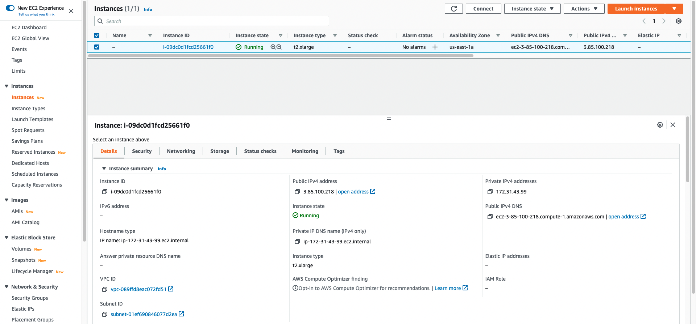

Consumo da Aplicação através do AWS EC2:


Acesso via SSH na instância do AWS EC2:

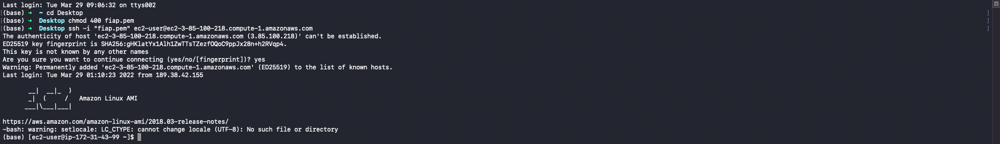

Inicialização do Jupyter na instência do AWS EC2:

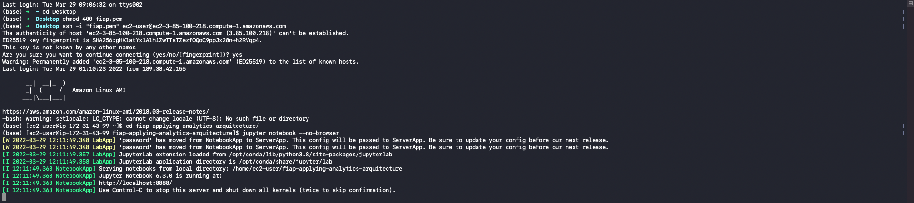

Acesso ao Jupyter:

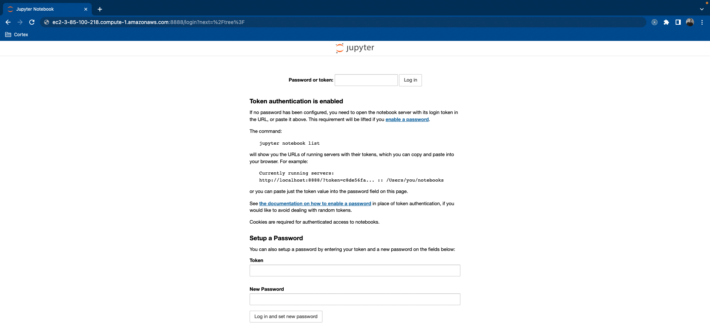

Jupyter:

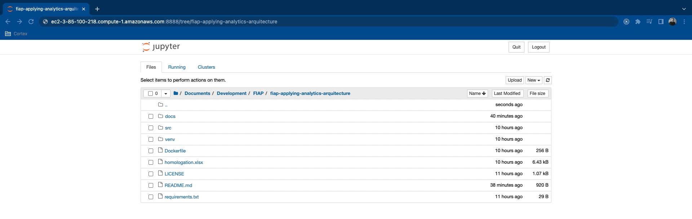

### ECR

Imagem do container Docker enviada para o AWS ECR:

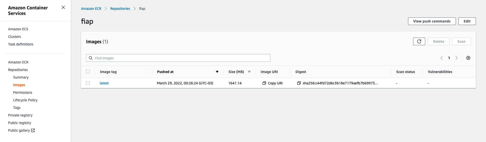

### EKS

Cluster criado no AWS EKS:


Visualização do Cluster pelo console da AWS:

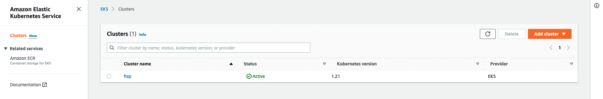

Lista dos serviços do *namespace*:

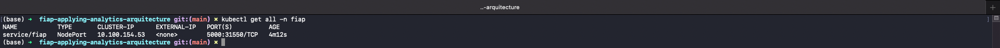

Descrição do serviço:

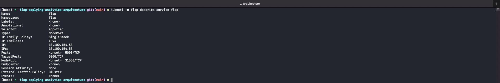

Criação do *nodegroup*:

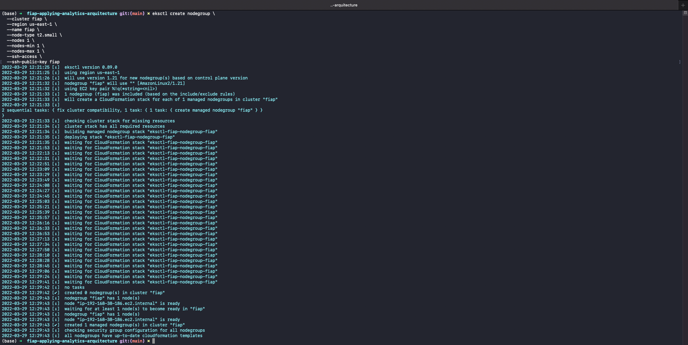

Criação dos nós:

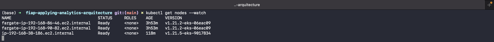

Consumo do serviço através do Load Balance:


