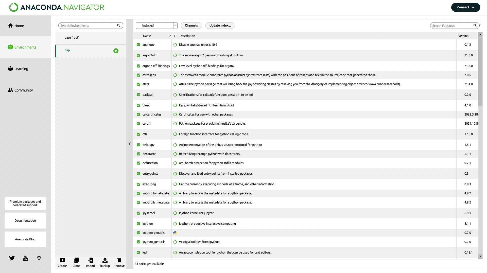
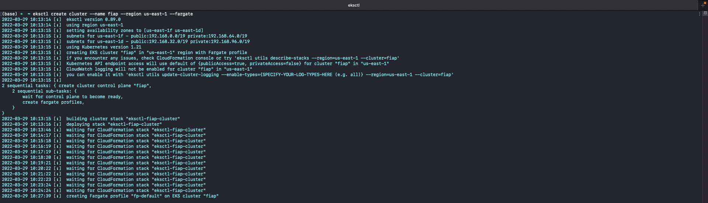

# FIAP Applying Analytics Arquitecture

## Grupo

* Bernardo Couto
* Raphael Freixo
* Ronaldo Nolasco

## Backlog

Sprint 1:


Sprint 2:


Sprint 3:


Sprint 4:


## Anaconda

Iniciando Anaconda:

```shel
$ conda init
```

Listando ambientes virtuais:

```shel
$ conda env list
```

Criando ambiente virtual:

```shel
$ conda env create --name fiap --file requirements.txt
```

Ativando ambiente virtual:

```shel
$ conda activate fiap
```

Ambiente virtual:



Anaconda Jupyter local:


## AWS

### EC2

Instância criada no AWS EC2:


Consumo da Aplicação através do AWS EC2:


Acesso via SSH na instância do AWS EC2:


Inicialização do Jupyter na instência do AWS EC2:


Acesso ao Jupyter:


Jupyter:


### ECR

Imagem do container Docker enviada para o AWS ECR:


### EKS

Cluster criado no AWS EKS:



Visualização do Cluster pelo console da AWS:


Lista dos serviços do *namespace*:


Descrição do serviço:


Criação do *nodegroup*:


Criação dos nós:


Consumo do serviço através do Load Balance:


